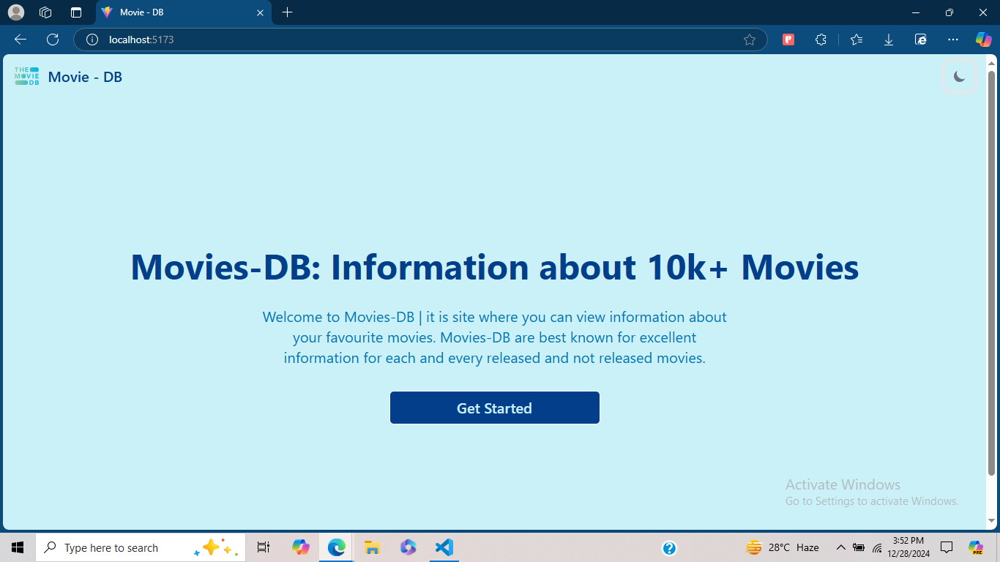
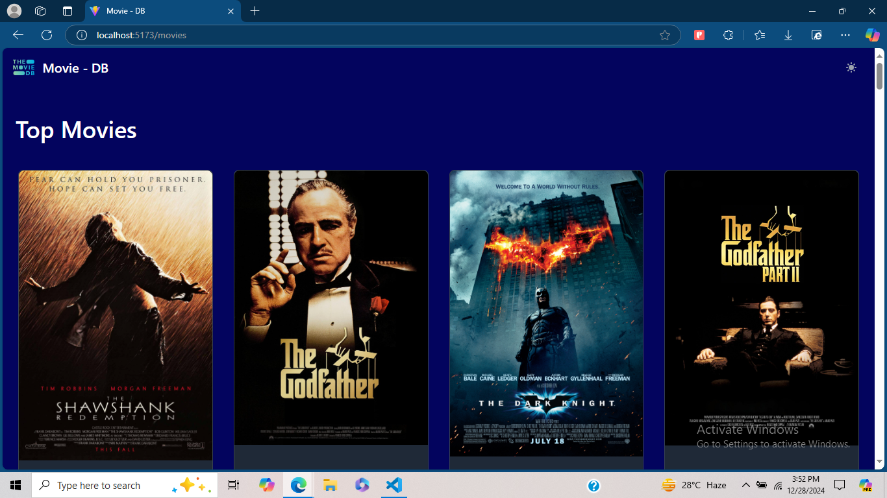
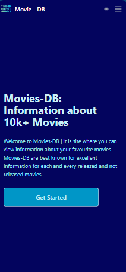
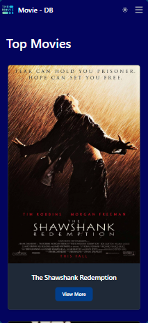

# Movie-DB

## Welcome to Movies-DB | it is site where you can view information about your favourite movies. Movies-DB are best known for excellent information for each and every released and not released movies.

## Installation

To get started with Movie-DB, follow these steps:

1. **Clone the repository**:
    ```bash
    git clone https://github.com/CodeNik07/movie-db.git
    cd movie-db
    ```

2. **Install dependencies**:
    ```bash
    npm install
    ```

3. **Run the application**:
    ```bash
    npm run dev
    ```

## Technology Used
[](https://skillicons.dev)

## Desktop - view


##


## Mobile - View


##

